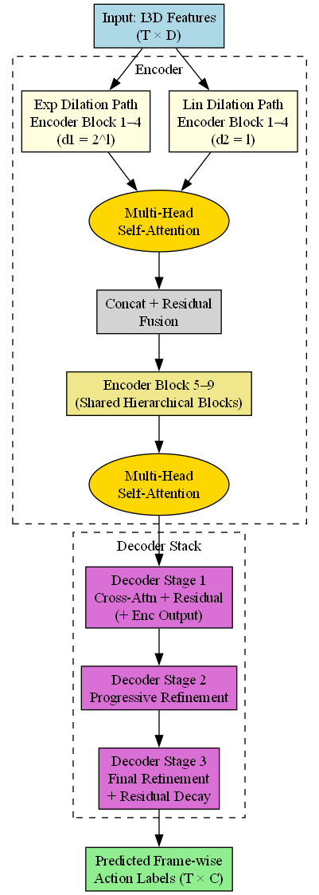

# LID-ASFormer: Dual-Dilated Attention-enhanced ASFormer for Temporal Action Segmentation

**LID-ASFormer** is a refined Transformer-based architecture for **Temporal Action Segmentation**, integrating the hierarchical encoder-decoder structure of ASFormer with the dual-dilation strategy of LID-TCN and multi-head self-attention. This model enhances temporal receptive field diversity and improves action boundary accuracy.

## 🧠 Key Features

- 🔁 **Dual-stage Temporal Dilation:**
  - Exponential dilation: `d1 = 2^l`
  - Linear dilation: `d2 = l`
- 🔍 **Multi-Head Self-Attention** within encoder blocks for rich temporal representation.
- 🎞️ **I3D-based Pre-extracted Features** as input for robust spatiotemporal cues.
- 🪜 **Hierarchical Refinement:** Encoder + 3-stage decoder for progressive label smoothing.
- 🎯 **Loss Function:** Combined cross-entropy and MSE loss for accurate and smooth transitions.

## 📐 Architecture Summary

- **Encoder:** 9 blocks, dual-dilation temporal convolutions + local window self-attention.
- **Decoder:** 3-stage prediction refinement via cross-attention and residual decay.
- **Input:** I3D features of shape (T × D), dropout = `0.3`
- **Optimizer:** Adam, learning rate = `0.0005`
- **Epochs:** 120

## 📊 Performance on GTEA Dataset

| Dataset    | F1@10 (%) | F1@25 (%) | F1@50 (%) | Edit (%) | Accuracy (%) |
|------------|-----------|-----------|-----------|----------|---------------|
| Breakfast  | 87.58     | 82.40     | 78.75     | 79.63    | 80.48         |
| GTEA       | 90.44     | 85.02     | 80.32     | 83.01    | 82.14         |

## References

- I3D: Carreira, J. and Zisserman, A. "Quo Vadis, Action Recognition? A New Model and the Kinetics Dataset." CVPR 2017.

- ASFormer: Yi, Y. et al. "ASFormer: Transformer for Action Segmentation." BMVC 2021.

- MS-LID-TCN: Ishikawa, H. et al. "MS-LID-TCN: Multi-Stage Locally-Invariant Dilated Temporal Convolution Network." ICPR 2022. 
